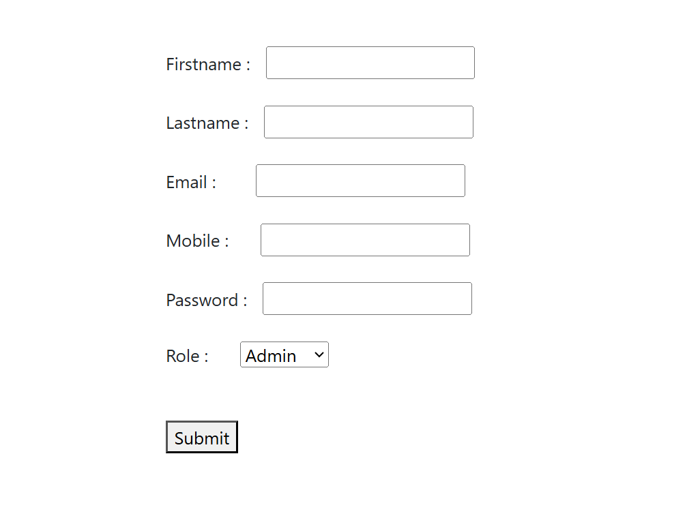

# Quiz App

This is a simple **Quiz App project** created using HTML, demonstrating a **basic flow for registration, login, user dashboard, and quiz dashboard screens**.

## 📂 Project Structure

- `Registration Form.html` - User registration page.
- `login page.html` - User login page.
- `user-page.html` - User home page after login.
- `DashBoard.html` - Main quiz dashboard screen.
- `DashBoard2.html` - Additional quiz dashboard or result screen.

## 🚀 Features

- 🔐 **Role-Based Authentication**  
  Register and log in with redirection based on your role (Admin/User)

- 🛠️ **Admin Dashboard**  
  - Create quiz questions with multiple-choice options  
  - Manage quiz content dynamically

- 👥 **User Dashboard**  
  - View and attempt quizzes created by the Admin  
  - Responsive quiz experience with intuitive UI

## 📸 Screenshots
 
 - `Registration Form.html` - User registration page.

- `login page.html` - User login page.

- `DashBoard.html` - Main quiz dashboard screen.

- `user-page.html` - User home page after login.

